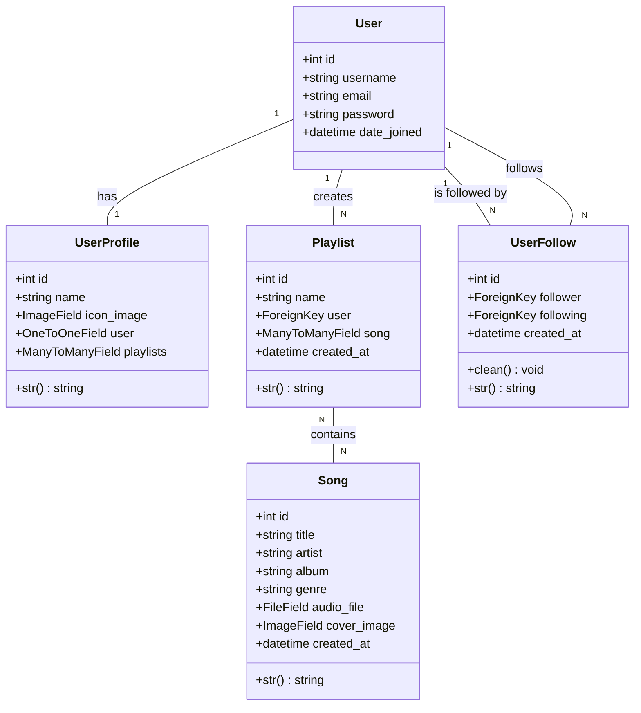
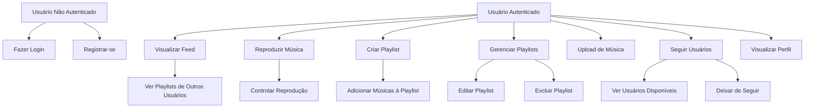

# Documentação Completa do Sistema Spotifake

## Sumário
1. [Visão Geral do Sistema](#visão-geral-do-sistema)
2. [Arquitetura do Sistema](#arquitetura-do-sistema)
3. [Diagramas de Classe](#diagramas-de-classe)
4. [Diagramas de Casos de Uso](#diagramas-de-casos-de-uso)
5. [Estrutura de Arquivos](#estrutura-de-arquivos)
6. [Backend - Django](#backend---django)
7. [Frontend - React](#frontend---react)
8. [API Endpoints](#api-endpoints)
9. [Funcionalidades](#funcionalidades)
10. [Configuração e Instalação](#configuração-e-instalação)
11. [Tecnologias Utilizadas](#tecnologias-utilizadas)

---

## Visão Geral do Sistema

O **Spotifake** é um clone full-stack do Spotify, desenvolvido como uma aplicação web que simula as principais funcionalidades de streaming de música. O sistema permite aos usuários fazer upload de músicas, criar playlists, seguir outros usuários e reproduzir música em tempo real.

### Objetivos do Sistema
- Proporcionar uma experiência similar ao Spotify
- Gerenciar biblioteca de músicas pessoais
- Criar e compartilhar playlists
- Sistema de seguimento entre usuários
- Reprodução de audio em tempo real

---

## Arquitetura do Sistema

### Visão Arquitetural

```
┌─────────────────┐    HTTP/API    ┌─────────────────┐
│                 │    Requests    │                 │
│   Frontend      │◄──────────────►│    Backend      │
│   (React)       │                │   (Django)      │
│   Port: 3000    │                │   Port: 8000    │
└─────────────────┘                └─────────────────┘
         │                                   │
         │                                   │
         ▼                                   ▼
┌─────────────────┐                ┌─────────────────┐
│   Web Browser   │                │   Database      │
│   (Client)      │                │   (SQLite)      │
└─────────────────┘                └─────────────────┘
```

#### Diagrama Detalhado da Arquitetura

```
Frontend (React - Port 3000)          Backend (Django - Port 8000)
┌──────────────────────────────┐      ┌──────────────────────────────┐
│                              │      │                              │
│  ┌─────────────────────────┐ │      │  ┌─────────────────────────┐ │
│  │      Components         │ │      │  │         Views           │ │
│  │  ┌─────────────────────┐│ │ HTTP │  │  ┌─────────────────────┐│ │
│  │  │ Login/Register      ││ │ ───► │  │  │ Authentication      ││ │
│  │  │ MainPage            ││ │ JSON │  │  │ Song Management     ││ │
│  │  │ MusicPlayer         ││ │ ◄─── │  │  │ Playlist CRUD       ││ │
│  │  │ Profile             ││ │      │  │  │ User Follow         ││ │
│  │  │ Feed                ││ │      │  │  │ API Endpoints       ││ │
│  │  └─────────────────────┘│ │      │  │  └─────────────────────┘│ │
│  └─────────────────────────┘ │      │  └─────────────────────────┘ │
│                              │      │                              │
│  ┌─────────────────────────┐ │      │  ┌─────────────────────────┐ │
│  │      State Management   │ │      │  │        Models           │ │
│  │  ┌─────────────────────┐│ │      │  │  ┌─────────────────────┐│ │
│  │  │ useState/useEffect  ││ │      │  │  │ User, UserProfile   ││ │
│  │  │ localStorage        ││ │      │  │  │ Song, Playlist      ││ │
│  │  │ Props/Callbacks     ││ │      │  │  │ UserFollow          ││ │
│  │  └─────────────────────┘│ │      │  │  └─────────────────────┘│ │
│  └─────────────────────────┘ │      │  └─────────────────────────┘ │
│                              │      │                              │
│  ┌─────────────────────────┐ │      │  ┌─────────────────────────┐ │
│  │        Routing          │ │      │  │      Serializers       │ │
│  │  ┌─────────────────────┐│ │      │  │  ┌─────────────────────┐│ │
│  │  │ React Router        ││ │      │  │  │ SongSerializer      ││ │
│  │  │ Route Protection    ││ │      │  │  │ PlaylistSerializer  ││ │
│  │  └─────────────────────┘│ │      │  │  │ UserSerializer      ││ │
│  └─────────────────────────┘ │      │  │  └─────────────────────┘│ │
└──────────────────────────────┘      │  └─────────────────────────┘ │
                                      │                              │
                                      │  ┌─────────────────────────┐ │
                                      │  │      Database           │ │
                                      │  │  ┌─────────────────────┐│ │
                                      │  │  │ SQLite File         ││ │
                                      │  │  │ ORM Mapping         ││ │
                                      │  │  │ Migrations          ││ │
                                      │  │  └─────────────────────┘│ │
                                      │  └─────────────────────────┘ │
                                      │                              │
                                      │  ┌─────────────────────────┐ │
                                      │  │      Media Storage      │ │
                                      │  │  ┌─────────────────────┐│ │
                                      │  │  │ Audio Files         ││ │
                                      │  │  │ Cover Images        ││ │
                                      │  │  │ Profile Pictures    ││ │
                                      │  │  └─────────────────────┘│ │
                                      │  └─────────────────────────┘ │
                                      └──────────────────────────────┘
```

### Padrão Arquitetural
- **Frontend**: Single Page Application (SPA) com React
- **Backend**: API RESTful com Django REST Framework
- **Banco de Dados**: SQLite (desenvolvimento)
- **Comunicação**: HTTP/JSON

---

## Diagramas de Classe

### Diagrama de Classes do Backend




### Relacionamentos das Classes

| Classe | Relacionamento | Classe Relacionada | Tipo |
|--------|---------------|-------------------|------|
| User | OneToOne | UserProfile | 1:1 |
| User | OneToMany | Playlist | 1:N |
| Playlist | ManyToMany | Song | N:N |
| User | OneToMany | UserFollow (follower) | 1:N |
| User | OneToMany | UserFollow (following) | 1:N |

---

## Diagramas de Casos de Uso

### Atores do Sistema
- **Usuário Não Autenticado**: Pode apenas fazer login ou registrar-se
- **Usuário Autenticado**: Acesso completo às funcionalidades

### Casos de Uso Principais



### Especificação de Casos de Uso

#### UC01 - Fazer Login
- **Ator**: Usuário Não Autenticado
- **Pré-condições**: Usuário possui conta no sistema
- **Fluxo Principal**:
  1. Usuário acessa a página de login
  2. Usuário insere username e senha
  3. Sistema valida credenciais
  4. Sistema redireciona para página principal
- **Pós-condições**: Usuário autenticado no sistema

#### UC02 - Reproduzir Música
- **Ator**: Usuário Autenticado
- **Pré-condições**: Usuário logado, música disponível
- **Fluxo Principal**:
  1. Usuário seleciona música ou playlist
  2. Sistema carrega arquivo de audio
  3. Sistema inicia reprodução
  4. Usuário pode controlar reprodução (play, pause, próxima, anterior)
- **Pós-condições**: Música sendo reproduzida

#### UC03 - Criar Playlist
- **Ator**: Usuário Autenticado
- **Pré-condições**: Usuário logado
- **Fluxo Principal**:
  1. Usuário acessa criação de playlist
  2. Usuário define nome da playlist
  3. Usuário seleciona músicas para adicionar
  4. Sistema salva playlist
- **Pós-condições**: Nova playlist criada

---

## Estrutura de Arquivos

### Estrutura Geral do Projeto

```
spotifake/
│
├── README.md                          # Documentação do projeto
├── DOCUMENTACAO_COMPLETA.md          # Esta documentação
│
├── src/
│   ├── backend/                      # Backend Django
│   │   ├── build/                   # Build do React para produção
│   │   └── spotifake/               # Projeto Django principal
│   │       ├── manage.py            # Gerenciador Django
│   │       ├── db.sqlite3           # Banco de dados SQLite
│   │       ├── media/               # Arquivos de mídia
│   │       │   ├── audio_files/     # Arquivos de audio
│   │       │   └── cover_images/    # Imagens de capa
│   │       ├── main/                # Aplicação principal
│   │       └── mysite/              # Configurações Django
│   │
│   └── frontend/                     # Frontend React
│       ├── package.json             # Dependências Node.js
│       ├── public/                  # Arquivos públicos
│       └── src/                     # Código fonte React
│           ├── App.js               # Componente principal
│           ├── Components/          # Componentes React
│           └── styles/              # Arquivos CSS
│
└── fodase                           # Arquivo temporário
```

---

## Backend - Django

### Aplicação Principal (`main`)

#### Models (Modelos de Dados)

##### Song (Música)
```python
class Song(models.Model):
    title = models.CharField(max_length=100)           # Título da música
    artist = models.CharField(max_length=100)          # Artista
    album = models.CharField(max_length=100)           # Album
    genre = models.CharField(max_length=50)            # Gênero
    audio_file = models.FileField(upload_to='audio_files/')  # Arquivo de audio
    cover_image = models.ImageField(upload_to='cover_images/', blank=True, null=True)  # Capa
    created_at = models.DateTimeField(auto_now_add=True)  # Data de criação
```

**Funcionalidades**:
- Armazenamento de metadados da música
- Upload de arquivo de audio (MP3, WAV, MP4)
- Upload de imagem de capa (opcional)
- Ordenação por título

##### Playlist
```python
class Playlist(models.Model):
    name = models.CharField(max_length=100)             # Nome da playlist
    user = models.ForeignKey(User, on_delete=models.CASCADE)  # Dono da playlist
    song = models.ManyToManyField(Song)                 # Músicas da playlist
```

**Funcionalidades**:
- Associação com usuário proprietário
- Relacionamento many-to-many com músicas
- Uma música pode estar em várias playlists

##### UserProfile (Perfil do Usuário)
```python
class UserProfile(models.Model):
    name = models.CharField(max_length=100)             # Nome de exibição
    icon_image = models.ImageField(upload_to='cover_images/', blank=True, null=True)  # Foto de perfil
    user = models.OneToOneField(User, on_delete=models.CASCADE)  # Usuário Django
    playlists = models.ManyToManyField(Playlist, blank=True)  # Playlists favoritas
```

**Funcionalidades**:
- Extensão do modelo User padrão do Django
- Foto de perfil personalizada
- Relacionamento com playlists

##### UserFollow (Seguimento de Usuários)
```python
class UserFollow(models.Model):
    follower = models.ForeignKey(User, on_delete=models.CASCADE, related_name='following')   # Quem segue
    following = models.ForeignKey(User, on_delete=models.CASCADE, related_name='followers')  # Quem é seguido
    created_at = models.DateTimeField(auto_now_add=True)  # Data do follow
```

**Funcionalidades**:
- Sistema de seguimento bidirecional
- Prevenção de auto-seguimento
- Controle temporal dos relacionamentos

#### Views (Controladores)

##### Views de Autenticação
- `login_user()`: Autenticação via API JSON
- `register_user()`: Registro de novos usuários
- `check_user_exists()`: Verificação de username disponível

##### Views de API (REST)
- `SongListAPIView`: Listagem de todas as músicas
- `SongUploadAPIView`: Upload de novas músicas
- `PlaylistListAPIView`: Listagem de playlists do usuário
- `PlaylistFeedView`: Feed de playlists de outros usuários
- `UserListAPIView`: Listagem de usuários para seguir

##### Views de Funcionalidades
- `follow_user()`: Seguir um usuário
- `unfollow_user()`: Deixar de seguir
- `create_playlist_api()`: Criar nova playlist
- `delete_playlist()`: Excluir playlist
- `update_playlist()`: Atualizar playlist existente

#### Serializers (Serializadores)

##### SongSerializer
```python
class SongSerializer(serializers.ModelSerializer):
    titulo = serializers.CharField(source='title')
    artista = serializers.CharField(source='artist')
    album = serializers.CharField()
    genero = serializers.CharField(source='genre')
    arquivo_audio = serializers.FileField(source='audio_file')
    imagem_capa = serializers.ImageField(source='cover_image')
```

**Funcionalidade**: Converte modelos Song para JSON com nomes em português

##### PlaylistSerializer
**Funcionalidade**: Serializa playlists com músicas aninhadas

##### UserProfileSerializer
**Funcionalidade**: Serializa perfis de usuário com playlists

##### PlaylistFeedSerializer
**Funcionalidade**: Serializa playlists para o feed com informações extras

#### URLs (Roteamento)

##### URLs de Autenticação
- `/api/login/` - POST: Login do usuário
- `/api/register/` - POST: Registro de usuário
- `/api/check-user/` - POST: Verificar disponibilidade de username

##### URLs de API
- `/api/songs/` - GET: Listar músicas
- `/api/song-upload/` - POST: Upload de música
- `/api/playlists/` - GET: Listar playlists (com userId)
- `/api/playlists/create/` - POST: Criar playlist
- `/api/playlists/<id>/update/` - PUT: Atualizar playlist
- `/api/playlists/<id>/delete/` - DELETE: Excluir playlist

##### URLs de Feed e Social
- `/api/feed/playlists/<user_id>/` - GET: Feed de playlists
- `/api/users/` - GET: Listar usuários
- `/api/follow/` - POST: Seguir usuário
- `/api/unfollow/` - POST: Deixar de seguir
- `/api/following/playlists/<user_id>/` - GET: Playlists de usuários seguidos

#### Configurações (`mysite/settings.py`)

##### Aplicações Instaladas
```python
INSTALLED_APPS = [
    'django.contrib.admin',
    'django.contrib.auth',
    'django.contrib.contenttypes',
    'django.contrib.sessions',
    'django.contrib.messages',
    'django.contrib.staticfiles',
    'main',                    # Aplicação principal
    'corsheaders',             # CORS para React
    'rest_framework',          # Django REST Framework
]
```

##### Middleware
```python
MIDDLEWARE = [
    'corsheaders.middleware.CorsMiddleware',  # CORS deve ser primeiro
    'django.middleware.security.SecurityMiddleware',
    'django.contrib.sessions.middleware.SessionMiddleware',
    'django.middleware.common.CommonMiddleware',
    # ... outros middlewares
]
```

##### Configurações de Mídia
```python
MEDIA_URL = '/media/'
MEDIA_ROOT = os.path.join(BASE_DIR, 'media')
```

---

## Frontend - React

### Estrutura de Componentes

#### App.js (Componente Principal)
```javascript
function App() {
  return (
    <Router>
      <Routes>
        <Route path="/" element={<Login />} />
        <Route path="/mainpage" element={<MainPage />} />
      </Routes>
    </Router>
  );
}
```

**Funcionalidade**: Roteamento principal da aplicação

### Componentes Principais

#### Login (`Components/Login/`)

##### Login.js
**Funcionalidades**:
- Formulário de autenticação
- Validação com React Hook Form
- Integração com API de login
- Armazenamento de dados do usuário no localStorage
- Redirecionamento após login bem-sucedido

**Campos do Formulário**:
- Username (obrigatório)
- Password (obrigatório, mínimo 6 caracteres)

##### RegisterCard.js
**Funcionalidades**:
- Modal de registro de novos usuários
- Validação de formulário
- Upload de foto de perfil (opcional)
- Verificação de username disponível

#### MainPage (`Components/MainPage/`)

##### MainPage.js
**Funcionalidades Principais**:
- Layout principal da aplicação
- Gerenciamento de estado da música atual
- Controle de fila de reprodução
- Integração entre componentes Profile, Feed e MusicPlayer

**Estados Gerenciados**:
```javascript
const [user, setUser] = useState(null);                    // Usuário atual
const [playlistQueue, setPlaylistQueue] = useState([]);    // Fila de músicas
const [currentIndex, setCurrentIndex] = useState(0);       // Índice atual na fila
const [currentSong, setCurrentSong] = useState(null);      // Música sendo tocada
const [isIndividualSong, setIsIndividualSong] = useState(false);  // Música individual vs playlist
```

**Funções Principais**:
- `handlePlayPlaylist()`: Inicia reprodução de playlist
- `handleSelectSong()`: Reproduz música individual
- `handleSongEnded()`: Avança para próxima música automaticamente
- `handleNextSong()`: Avança manualmente
- `handlePreviousSong()`: Volta música anterior

#### Profile (`Components/Profile/`)

##### Profile.js
**Funcionalidades**:
- Exibição de informações do usuário
- Listagem de playlists do usuário
- Navegação entre abas (Minhas Músicas, Minhas Playlists, Upload, Seguindo)
- Integração com reprodução de música

##### MusicUpload.js
**Funcionalidades**:
- Formulário de upload de música
- Campos: título, artista, álbum, gênero
- Upload de arquivo de audio
- Upload de imagem de capa (opcional)
- Validação de formulário

#### Feed (`Components/Feed/`)

##### Feed.js
**Funcionalidades**:
- Exibição de playlists de outros usuários
- Listagem de usuários para seguir
- Sistema de seguir/deixar de seguir
- Reprodução de playlists do feed

**Abas do Feed**:
1. **Descobrir**: Playlists de todos os usuários (exceto o próprio)
2. **Seguindo**: Playlists apenas de usuários seguidos

#### MusicPlayer (`Components/MusicPlayer/`)

##### MusicPlayer.js
**Funcionalidades**:
- Player de audio HTML5
- Controles de reprodução (play, pause, próxima, anterior)
- Barra de progresso
- Controle de volume
- Exibição de informações da música atual
- Integração com fila de reprodução

**Controles Disponíveis**:
- ⏮️ Música anterior (se disponível)
- ⏯️ Play/Pause
- ⏭️ Próxima música (se disponível)
- 🔊 Controle de volume
- Barra de progresso com seek

#### Musicas (`Components/Musicas/`)

##### SongList.js
**Funcionalidades**:
- Listagem de todas as músicas disponíveis
- Busca e filtros
- Reprodução individual de músicas
- Adição de músicas a playlists

##### PlaylistModal.js
**Funcionalidades**:
- Modal para criação/edição de playlists
- Seleção de músicas para adicionar
- Validação de dados da playlist

##### PlaylistSongs.js
**Funcionalidades**:
- Exibição de músicas de uma playlist específica
- Reprodução da playlist completa
- Remoção de músicas da playlist

### Gerenciamento de Estado

#### Estados Locais por Componente
- **Login**: Estado do formulário, modo registro
- **MainPage**: Estado global da reprodução
- **Profile**: Abas ativas, dados do usuário
- **Feed**: Dados do feed, usuários seguidos
- **MusicPlayer**: Estado do player, música atual

#### Comunicação Entre Componentes
- **Props**: Passagem de dados e funções entre componentes pai-filho
- **localStorage**: Persistência de dados do usuário
- **Callbacks**: Comunicação de componentes filhos para pais

### Integração com API

#### Configuração Base
```javascript
const API_BASE_URL = 'http://localhost:8000';
```

#### Principais Chamadas de API
- `fetch('/api/login/')` - Autenticação
- `fetch('/api/songs/')` - Listar músicas
- `fetch('/api/playlists/')` - Listar playlists
- `fetch('/api/users/')` - Listar usuários
- `fetch('/api/follow/')` - Seguir usuário

### Estilos (CSS)

#### Arquivos de Estilo
- `App.css`: Estilos globais da aplicação
- `Login.css`: Estilos específicos do login
- `index.css`: Reset e estilos base

#### Design System
- **Layout**: Flexbox e Grid
- **Cores**: Tema escuro inspirado no Spotify
- **Tipografia**: Fontes modernas e legíveis
- **Responsividade**: Adaptação para diferentes telas

---

## API Endpoints

### Documentação Completa da API

#### Autenticação

##### POST `/api/login/`
**Descrição**: Autentica usuário no sistema
**Body**:
```json
{
  "username": "string",
  "password": "string"
}
```
**Resposta Sucesso (200)**:
```json
{
  "message": "Login bem-sucedido.",
  "user": {
    "id": 1,
    "username": "usuario",
    "email": "usuario@email.com"
  }
}
```

##### POST `/api/register/`
**Descrição**: Registra novo usuário
**Body**:
```json
{
  "username": "string",
  "email": "string",
  "password": "string",
  "name": "string"
}
```
**Resposta Sucesso (201)**:
```json
{
  "message": "Usuário registrado com sucesso."
}
```

##### POST `/api/check-user/`
**Descrição**: Verifica se username existe
**Body**:
```json
{
  "username": "string"
}
```
**Resposta (200)**:
```json
{
  "exists": boolean
}
```

#### Músicas

##### GET `/api/songs/`
**Descrição**: Lista todas as músicas
**Resposta (200)**:
```json
[
  {
    "id": 1,
    "titulo": "Nome da Música",
    "artista": "Nome do Artista",
    "album": "Nome do Album",
    "genero": "Rock",
    "arquivo_audio": "/media/audio_files/musica.mp3",
    "imagem_capa": "/media/cover_images/capa.jpg",
    "criado_em": "2024-01-01T10:00:00Z"
  }
]
```

##### POST `/api/song-upload/`
**Descrição**: Upload de nova música
**Content-Type**: `multipart/form-data`
**Body**:
- `title`: string
- `artist`: string
- `album`: string
- `genre`: string
- `audio_file`: file
- `cover_image`: file (opcional)

#### Playlists

##### GET `/api/playlists/?userId={id}`
**Descrição**: Lista playlists do usuário
**Parâmetros**: `userId` (obrigatório)
**Resposta (200)**:
```json
{
  "success": true,
  "count": 2,
  "userId": "1",
  "playlists": [
    {
      "id": 1,
      "nome": "Minha Playlist",
      "usuario": "username",
      "musicas": [...]
    }
  ]
}
```

##### POST `/api/playlists/create/`
**Descrição**: Cria nova playlist
**Body**:
```json
{
  "name": "string",
  "user_id": number,
  "song_ids": [1, 2, 3]
}
```

##### PUT `/api/playlists/{id}/update/`
**Descrição**: Atualiza playlist existente
**Body**:
```json
{
  "name": "string",
  "user_id": number,
  "song_ids": [1, 2, 3]
}
```

##### DELETE `/api/playlists/{id}/delete/`
**Descrição**: Exclui playlist
**Resposta (200)**:
```json
{
  "success": true,
  "message": "Playlist excluída com sucesso."
}
```

#### Feed

##### GET `/api/feed/playlists/{user_id}/`
**Descrição**: Playlists de outros usuários (feed)
**Resposta (200)**:
```json
[
  {
    "id": 1,
    "nome": "Playlist Pública",
    "usuario": "outro_usuario",
    "musicas": [...],
    "total_musicas": 5,
    "imagem_capa_playlist": "url_da_imagem",
    "perfil_usuario": {
      "nome": "Nome do Usuário",
      "imagem_perfil": "url_da_imagem"
    }
  }
]
```

##### GET `/api/following/playlists/{user_id}/`
**Descrição**: Playlists de usuários seguidos
**Resposta**: Mesmo formato do feed

#### Sistema Social

##### GET `/api/users/?current_user_id={id}`
**Descrição**: Lista usuários disponíveis para seguir
**Resposta (200)**:
```json
[
  {
    "id": 2,
    "username": "outro_usuario",
    "profile_name": "Nome do Usuário",
    "profile_image": "url_da_imagem",
    "is_following": false
  }
]
```

##### POST `/api/follow/`
**Descrição**: Seguir um usuário
**Body**:
```json
{
  "follower_id": number,
  "following_id": number
}
```

##### POST `/api/unfollow/`
**Descrição**: Deixar de seguir um usuário
**Body**:
```json
{
  "follower_id": number,
  "following_id": number
}
```

---

## Funcionalidades

### Funcionalidades Implementadas

#### 1. Sistema de Autenticação
- **Login**: Autenticação via username/password
- **Registro**: Criação de novos usuários com perfil
- **Sessão**: Manutenção de sessão via localStorage
- **Validação**: Verificação de campos obrigatórios

#### 2. Gerenciamento de Músicas
- **Upload**: Upload de arquivos de audio (MP3, WAV, MP4)
- **Metadados**: Título, artista, álbum, gênero
- **Capa**: Upload opcional de imagem de capa
- **Listagem**: Visualização de todas as músicas
- **Busca**: Localização de músicas específicas

#### 3. Sistema de Playlists
- **Criação**: Criação de playlists personalizadas
- **Edição**: Modificação de nome e músicas
- **Exclusão**: Remoção de playlists
- **Compartilhamento**: Visualização pública das playlists
- **Organização**: Múltiplas playlists por usuário

#### 4. Reprodução de Audio
- **Player HTML5**: Reprodução nativa no navegador
- **Controles**: Play, pause, próxima, anterior
- **Fila**: Reprodução sequencial de playlists
- **Individual**: Reprodução de músicas avulsas
- **Progresso**: Barra de progresso com seek
- **Volume**: Controle de volume

#### 5. Sistema Social
- **Feed**: Visualização de playlists de outros usuários
- **Seguir**: Sistema de seguimento entre usuários
- **Descoberta**: Exploração de novos conteúdos
- **Filtros**: Visualização de conteúdo de usuários seguidos

#### 6. Interface de Usuário
- **Responsiva**: Adaptação para diferentes dispositivos
- **Moderna**: Design inspirado no Spotify
- **Intuitiva**: Navegação simples e clara
- **Abas**: Organização por funcionalidades

### Fluxos de Trabalho Principais

#### Fluxo de Registro e Login
```
1. Usuário acessa página inicial
2. Clica em "Registrar" ou faz login
3. Preenche formulário
4. Sistema valida dados
5. Usuário é redirecionado para página principal
6. Dados são salvos no localStorage
```

#### Fluxo de Upload de Música
```
1. Usuário vai para aba "Upload"
2. Preenche metadados da música
3. Seleciona arquivo de audio
4. Opcionalmente adiciona capa
5. Sistema faz upload para servidor
6. Música fica disponível na biblioteca
```

#### Fluxo de Criação de Playlist
```
1. Usuário acessa "Minhas Playlists"
2. Clica em "Criar Nova Playlist"
3. Define nome da playlist
4. Seleciona músicas para adicionar
5. Sistema cria playlist
6. Playlist aparece na lista do usuário
```

#### Fluxo de Reprodução
```
1. Usuário seleciona música ou playlist
2. Sistema carrega arquivo de audio
3. Player inicia reprodução
4. Usuário pode controlar reprodução
5. Sistema gerencia fila automaticamente
6. Próxima música toca automaticamente (em playlists)
```

---

## Configuração e Instalação

### Pré-requisitos

#### Software Necessário
- **Python**: Versão 3.8 ou superior
- **Node.js**: Versão 14 ou superior (inclui npm)
- **Git**: Para clonar o repositório

#### Verificação de Instalação
```bash
python3 --version
node --version
npm --version
git --version
```

### Instalação Passo a Passo

#### 1. Clonar o Repositório
```bash
git clone <url-do-repositorio>
cd spotifake
```

#### 2. Configuração do Backend

##### 2.1. Navegar para pasta do backend
```bash
cd src/backend/spotifake
```

##### 2.2. Criar ambiente virtual
```bash
python3 -m venv venv
source venv/bin/activate  # Linux/macOS
# ou
venv\Scripts\activate     # Windows
```

##### 2.3. Instalar dependências Python
```bash
pip install django djangorestframework django-cors-headers Pillow
```

##### 2.4. Executar migrações do banco
```bash
python3 manage.py migrate
```

##### 2.5. (Opcional) Criar superusuário
```bash
python3 manage.py createsuperuser
```

#### 3. Configuração do Frontend

##### 3.1. Navegar para pasta do frontend
```bash
cd ../../../frontend  # A partir da pasta do backend
```

##### 3.2. Instalar dependências Node.js
```bash
npm install
```

### Execução da Aplicação

#### Terminal 1: Backend
```bash
cd src/backend/spotifake
source venv/bin/activate
python3 manage.py runserver
```
**Endereço**: http://localhost:8000

#### Terminal 2: Frontend
```bash
cd src/frontend
npm start
```
**Endereço**: http://localhost:3000

### Estrutura de Produção

#### Build para Produção
```bash
cd src/frontend
npm run build
```

O comando `npm run build` no frontend está configurado para:
1. Remover build anterior do backend
2. Gerar novo build otimizado
3. Copiar arquivos para pasta do backend
4. Permitir servir React através do Django

### Configurações Importantes

#### Backend (Django)
- **CORS**: Configurado para aceitar requisições do React
- **MEDIA_ROOT**: Pasta para upload de arquivos
- **DEBUG**: True para desenvolvimento
- **ALLOWED_HOSTS**: Configurar para produção

#### Frontend (React)
- **API_BASE_URL**: http://localhost:8000 para desenvolvimento
- **Proxy**: Não configurado (CORS usado no backend)

### Solução de Problemas

#### Problemas Comuns

##### 1. Erro "Pillow não instalado"
```bash
pip install Pillow
```

##### 2. Erro "Module not found" no React
```bash
rm -rf node_modules package-lock.json
npm cache clean --force
npm install
```

##### 3. Erro de CORS
- Verificar se `corsheaders` está instalado
- Confirmar middleware no settings.py
- Verificar CORS_ALLOWED_ORIGINS

##### 4. Erro de porta em uso
```bash
# Para Django
sudo lsof -t -i tcp:8000 | xargs kill -9

# Para React
sudo lsof -t -i tcp:3000 | xargs kill -9
```

---

## Tecnologias Utilizadas

### Backend Technologies

#### Framework e Bibliotecas
- **Django 5.2.1**: Framework web principal
- **Django REST Framework**: Criação de APIs RESTful
- **django-cors-headers**: Configuração de CORS
- **Pillow**: Processamento de imagens

#### Banco de Dados
- **SQLite**: Banco padrão para desenvolvimento
- **ORM Django**: Mapeamento objeto-relacional

#### Autenticação
- **Django Auth**: Sistema de usuários integrado
- **Session-based Auth**: Autenticação baseada em sessão

### Frontend Technologies

#### Framework e Bibliotecas Principais
- **React 19.1.0**: Framework JavaScript
- **React DOM 19.1.0**: Renderização do React
- **React Router DOM 7.6.2**: Roteamento SPA

#### Formulários e Validação
- **React Hook Form 7.58.1**: Gerenciamento de formulários
- **Validação**: Validação integrada com React Hook Form

#### Interface e Ícones
- **React Icons 5.5.0**: Biblioteca de ícones
- **Lucide React 0.525.0**: Ícones modernos
- **CSS3**: Estilização customizada

#### Ferramentas de Desenvolvimento
- **React Scripts 5.0.1**: Ferramenta de build
- **Create React App**: Configuração base do projeto

#### Testes
- **Testing Library**: Framework de testes
  - **@testing-library/react 16.3.0**
  - **@testing-library/jest-dom 6.6.3**
  - **@testing-library/user-event 13.5.0**

### Ferramentas de Desenvolvimento

#### Controle de Versão
- **Git**: Controle de versão
- **GitHub**: Hospedagem do repositório

#### Ambiente de Desenvolvimento
- **VS Code**: Editor recomendado
- **Python 3.8+**: Interpretador Python
- **Node.js 14+**: Runtime JavaScript

#### Build e Deploy
- **Webpack**: Bundler (via React Scripts)
- **Babel**: Transpilação JavaScript
- **ESLint**: Linting de código

### Arquivos de Mídia

#### Formatos Suportados
- **Audio**: MP3, WAV, MP4
- **Imagem**: JPG, PNG, GIF
- **Upload**: Multipart/form-data

#### Armazenamento
- **Local**: Pasta `media/` no backend
- **Produção**: Configurável para cloud storage

### Comunicação e API

#### Protocolo
- **HTTP/HTTPS**: Comunicação cliente-servidor
- **JSON**: Formato de dados
- **REST**: Padrão arquitetural da API

#### Autenticação API
- **Session-based**: Autenticação baseada em sessão Django
- **CSRF**: Proteção contra ataques CSRF (desabilitado para API)

### Segurança

#### Medidas Implementadas
- **Validação de Entrada**: Validação tanto no frontend quanto backend
- **Sanitização**: Limpeza de dados de entrada
- **Autenticação**: Verificação de usuário logado
- **CORS**: Controle de origem das requisições

#### Considerações de Produção
- **HTTPS**: Certificado SSL necessário
- **Variáveis de Ambiente**: Para configurações sensíveis
- **Backup**: Backup regular do banco de dados
- **Logs**: Sistema de logging para monitoramento

---

## Conclusão

O **Spotifake** é uma aplicação web completa que demonstra a implementação de um sistema de streaming de música usando tecnologias modernas. O projeto apresenta uma arquitetura bem estruturada, separando claramente frontend e backend, com uma API RESTful robusta e uma interface de usuário intuitiva.

### Pontos Fortes do Sistema
1. **Arquitetura Limpa**: Separação clara entre frontend e backend
2. **API RESTful**: Endpoints bem documentados e organizados
3. **Interface Moderna**: Design inspirado no Spotify
4. **Funcionalidades Completas**: Upload, playlists, reprodução, sistema social
5. **Tecnologias Atuais**: React e Django nas versões mais recentes

### Possíveis Melhorias Futuras
1. **Autenticação JWT**: Para melhor escalabilidade
2. **Testes Automatizados**: Cobertura completa de testes
3. **Cache**: Implementação de cache para melhor performance
4. **Busca Avançada**: Filtros e busca mais sofisticados
5. **Notificações**: Sistema de notificações em tempo real
6. **Mobile**: Versão mobile responsiva
7. **Cloud Storage**: Armazenamento de mídia na nuvem

### Documentação Atualizada
Esta documentação serve como referência completa para desenvolvedores que queiram entender, modificar ou expandir o sistema Spotifake. Todos os diagramas, fluxos e especificações técnicas estão organizados para facilitar a manutenção e evolução do projeto.

---

**Data de Criação**: 1 de julho de 2025  
**Versão da Documentação**: 1.0  
**Autor**: Sistema Spotifake Team
